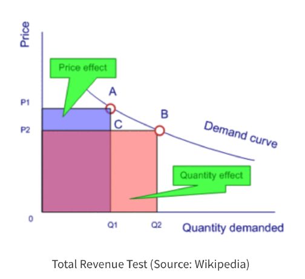

# PriceOptimization

Pricing optimization is another valuable use for data scientists. 

# Background
Pricing is one of toughest challenges for most companies. 
To begin, there are different pricing methodologies depending on the industry, product, brand power, and so on. And to make things trickier, a product can command drastically different prices depending on the context. 
Let's take a bottle of water for example. For $2, you could buy a 6-pack of bottled water at a supermarket. However, those same $2 might only afford you one bottle at a movie theatre. 
As a result, companies will try to find the optimal price, that which maximizes earnings (a.k.a. "gross revenue"), for their market. 

## How to Use
The Installation process will get you a copy of the project up and running on your local machine for development and testing purposes
1. Clone or download the project into your local machine.
2. Unzip the project folder.
3. Open the source file [Pricing Test Analysis](PricingTest-Analysis.ipynb) using [JypyterNotebook](http://jupyter.org/) and execute the file.

## Repository Contains
 - Data -- Contains the raw data folder
 - Images -- Folder contains the images used in python notebook 

If there are any issues in the code, raise them [here](https://github.com/Niranjankumar-c/PriceOptimization/issues)

## Author
- Connect with me on [linkedin](https://www.linkedin.com/in/niranjankumar-c/).
- Follow me on medium for blogs related to machine learning & deeplearning: 
    - https://towardsdatascience.com/@niranjankumarc
    - https://hackernoon.com/@niranjankumarc

### License
The code and files in this repository is made available for free released under [MIT](LICENSE).
